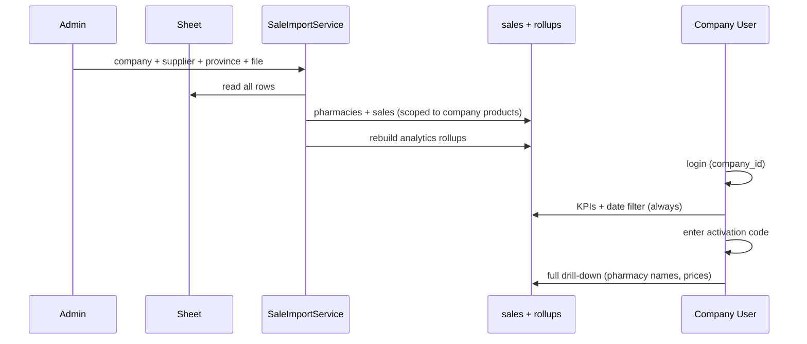

# Orca Med — الفلو المعتمد (توضيح المنتج)

> آخر تحديث: 2026-05-23  
> يُكمّل [STITCH_UI_TASKS.md](./STITCH_UI_TASKS.md) و [ARCHITECTURE.md](./ARCHITECTURE.md).

---

## 1. ملخص سريع

| المحور | القرار |
|--------|--------|
| **الشركة** | تسجّل دخول بحساب يُنشئه الأدمن → ترى **إحصائيات عامة** لأصناف شركتها فقط + **فلتر تاريخ** |
| **التفاصيل الكاملة** | بعد **تفعيل كود** (يوم أو أكثر حسب إعداد الأدمن) — ليس كلمة مرور ثابتة لكل شركة |
| **الرفع (الأهم)** | شيت Excel يُقرأ **سطراً سطراً**؛ عند الرفع يختار الأدمن/المشغّل: **الشركة + المورد + المحافظة** لهذه الدفعة |
| **اسم المخزن في الشيت** | = **اسم نقطة البيع** (صيدلية/مخزن — نفس الكيان في المنطق، جدول `pharmacies` فقط) |
| **أعمدة الشيت** | اسم النقطة، الكمية، اسم الصنف، التاريخ، السعر، الخصم |

---

## 2. رحلة مستخدم الشركة

### 2.1 ما يراه دائماً (بدون كود)

بعد `login` بحساب مرتبط بـ `company_id`:

- لوحة **إحصائيات عامة** لكل **صنف تابع للشركة** (ليس أصناف غيرها).
- **فلتر فترة زمنية** (تقويم: من / إلى) يطبَّق على كل المؤشرات في هذه الشاشة.
- أمثلة مؤشرات «عامة» (قراءة فقط):
  - إجمالي **الكمية المباعة** للصنف في الفترة.
  - عدد **عمليات البيع** (صفوف).
  - توزيع **حسب المحافظة** (أرقام مجمّعة — بدون أسماء صيدليات إن لم يُفعَّل الكود).
  - مقارنة فترتين (اختياري لاحقاً).

**مصدر البيانات:** `sales` + `products.company_id` + جداول التجميع `analytics_*` (بعد الاستيراد).

### 2.2 ما يظهر بعد تفعيل الكود

عند إدخال **كود تفعيل** صالح:

- تُمدَّد صلاحية **عرض التفاصيل الكاملة** للمستخدم (أو للشركة — انظر 2.3) لمدة **N يوماً** (`duration_days` من الكود).
- يصبح متاحاً مثلاً:
  - أسماء **نقاط البيع** (من عمود الشيت).
  - تفصيل **كل صف بيع** (صيدلية، كمية، تاريخ، سعر، خصم).
  - التعمق: صنف → محافظة → قائمة نقاط البيع بكمياتها.

**لا يعتمد على:** موافقة أدمن لكل صنف على حدة (يمكن إلغاء `pharmacy_access_requests` لاحقاً أو إبقاؤها كطبقة إضافية — الافتراضي الجديد = **كود التفعيل فقط**).

### 2.3 نموذج أكواد التفعيل (مستوحى من Dwaa)

```
activation_codes
  code, duration_days, max_uses, used_count, is_active, expires_at (صلاحية الكود نفسه)

company_users (أو users)
  analytics_unlock_expires_at   -- بديل/أوضح من sensitive_unlock_expires_at
```

| من يفعل ماذا | الوصف |
|--------------|--------|
| **الأدمن** | ينشئ أكواداً من الداشبورد: عدد الأيام لكل استخدام، حد استخدامات، تاريخ انتهاء الكود |
| **مستخدم الشركة** | صفحة «تفعيل الكود» → `POST` → يزيد `analytics_unlock_expires_at` بـ `duration_days` |
| **التحقق** | `CompanyAnalyticsService` / `PharmacyAccessService`: إن `now() < analytics_unlock_expires_at` → لا masking |

**فرق عن الوضع الحالي في الكود:**

| حالي | معتمد |
|------|--------|
| `companies.sensitive_view_password` + `POST /sensitive-unlock` | **أكواد تفعيل** قابلة لإعادة الاستخدام بعدد مرات محدود |
| `pharmacy_access_requests` لكل product | اختياري / يُستبدل بالكود للتفاصيل الكاملة |
| إحصائيات بدون تاريخ واضح في كل الشاشات | **فلتر تقويم إلزامي** في واجهة الشركة |

---

## 3. رحلة الرفع (Excel) — الأهم

### 3.1 شكل الشيت الفعلي (من ملفك)

ترتيب الأعمدة في الملف المرسل (يمكن اكتشافها بالعناوين أو بالترتيب إن لم يوجد صف عناوين):

| العمود في الشيت | الحقل المنطقي | ملاحظة |
|-----------------|---------------|--------|
| اسم المخزن/الصيدلية | `outlet_name` | مثال: `مخزن عمر بن الخطاب/الزقازيق` — **كيان واحد** |
| الكمية | `quantity` | أعداد صحيحة |
| الصنف | `product_name` | اسم كامل مثل «جافيسكون دابل اكشن معلق 150 مل» |
| التاريخ | `sold_at` | `DD/MM/YYYY` |
| السعر | `unit_price` | مثال 144، 288 |
| الخصم | `discount` | مثال 28.5، 30 |

**لا يُؤخذ من الشيت (يُختار عند الرفع):**

- الشركة المنتجة (`company_id`)
- المورد (`supplier_id`)
- المحافظة (`province_id`)

كل صفوف هذه الدفعة تُربط بنفس الثلاثة + تُفلتر تحليلات الشركة لاحقاً عبر `products.company_id`.

### 3.2 نموذج الرفع في الواجهة

```
┌─────────────────────────────────────────┐
│  رفع ملف مبيعات                        │
├─────────────────────────────────────────┤
│  الشركة:      [ dropdown ]  ← إلزامي   │
│  المورد:      [ dropdown ]  ← إلزامي   │
│  المحافظة:    [ dropdown ]  ← إلزامي   │
│  الملف:       [ اختيار Excel ]         │
│  [ رفع وبدء المعالجة ]                 │
└─────────────────────────────────────────┘
```

بعد النجاح: تحديث `analytics_*_rollups` لأصناف الشركة المتأثرة.

### 3.3 منطق المعالجة (مثل Dwaa — قراءة كل الصفوف)

1. رفع الملف → `upload_batches` بحالة `queued`.
2. `ProcessSaleImportJob`:
   - اكتشاف الصف الأول (عناوين أو بيانات).
   - `validateExcelSchema` بأعمدة جديدة في `config/sale_import.php`.
   - لكل صف:
     - **مطابقة الصنف:** `product_name` ضمن `products` حيث `company_id = batch.company_id` (تطبيع اسم / fuzzy لاحقاً).
     - **نقطة البيع:** `firstOrCreate` على `pharmacies` بالاسم + `supplier_id` + `province_id` من الدفعة (لا جدول `warehouses` منفصل في هذا المسار).
     - **تجاهل** صفوف مثل «رصيد اول المده» إن وُضعت في قائمة استثناءات.
     - حفظ `sales` مع `quantity`, `sold_at`, `unit_price`, `discount`, `upload_batch_id`, `company_id` (مباشرة أو عبر product).
3. `import_hash` يشمل السعر/الخصم إن لزم منع التكرار بدقة أعلى.

### 3.4 توحيد «مخزن» و«صيدلية»

| في الكود اليوم | بعد التوحيد |
|----------------|-------------|
| `warehouses` + `users.warehouse_id` + `sales.warehouse_id` | يبقى **اختياري** لمستخدمي «مخزن» يرفعون لاحقاً باسم حسابهم |
| عمود الشيت → `pharmacy_name` / warehouse | عمود واحد: **`outlet_name`** → يُخزَّن في **`pharmacies.name`** فقط |
| `SaleImportService` يفرّع حسب `batch.warehouse_id` | المسار الأساسي: **`batch.company_id` + `supplier_id` + `province_id`** بدون اشتراط warehouse |

> الجداول القديمة لا تُحذف فوراً؛ مسار الاستيراد الجديد لا يعتمد على `warehouses` إلا إذا رفع مستخدم مخزن مرتبط بمخزن (مرحلة لاحقة).

---

## 4. ربط الرفع ↔ دخول الشركة



**شرط:** كل `product_id` في المبيعات المستوردة يجب أن يكون `products.company_id = batch.company_id` وإلا صف خطأ «الصنف لا يتبع هذه الشركة».

---

## 5. تغييرات قاعدة البيانات المطلوبة

| جدول | عمود | الغرض |
|------|------|--------|
| `upload_batches` | `company_id` | شركة الدفعة |
| `upload_batches` | `supplier_id` | مورد الدفعة |
| `upload_batches` | `province_id` | محافظة الدفعة |
| `upload_batches` | `warehouse_id` | اختياري — يُبطَّأ اعتماده في المسار الرئيسي |
| `sales` | `unit_price` | nullable decimal |
| `sales` | `discount` | nullable decimal |
| `activation_codes` | جديد | أكواد التفعيل |
| `users` | `analytics_unlock_expires_at` | بديل أوضح لـ `sensitive_unlock_expires_at` |

---

## 6. تغييرات API / Services (مرجع للتنفيذ)

| المكوّن | التعديل |
|---------|---------|
| `config/sale_import.php` | أعمدة: `outlet_name`, `product_name`, `quantity`, `sold_at`, `unit_price`, `discount`؛ إزالة اشتراط `province_name` من الشيت |
| `SaleImportService::createQueuedBatch` | يستقبل `company_id`, `supplier_id`, `province_id` |
| `SaleImportController` / Web `ImportController` | validation للحقول الثلاثة + ملف |
| `CompanyAnalyticsService` | فلتر `from` / `to` على كل الاستعلامات |
| `PharmacyAccessService::shouldMaskPharmacies` | يتحقق من `analytics_unlock_expires_at` (والكود بدل كلمة المرور) |
| **جديد** `ActivationCodeService` | مثل Dwaa `ActivationService` |
| **جديد** Admin CRUD | أكواد التفعيل في الداشبورد |

---

## 7. واجهة Stitch — ما يتأثر

| شاشة | التعديل |
|------|---------|
| رفع Excel | 3 قوائم منسدلة (شركة، مورد، محافظة) + منطقة ملف — **ليس** warehouse_id فقط |
| لوحة الشركة | تقويم فترة أعلى الصفحة |
| تحليلات الصنف | تبويب «عام» دائماً + قسم «تفاصيل» مقفول حتى التفعيل |
| إعدادات / مستخدمون | الأدمن: إدارة أكواد التفعيل (من S12 في Stitch) |
| إزالة/إخفاء | واجهة «كلمة المرور الإضافية» الحالية إن استُبدلت بالكود |

---

## 8. ترتيب التنفيذ المقترح (بعد توضيح الفلو)

1. **Migration** — `upload_batches` + `sales` + `activation_codes` + حقل المستخدم.
2. **SaleImportService** — schema شيتك + سياق الدفعة (شركة/مورد/محافظة).
3. **ActivationCodeService** + endpoints + صفحة تفعيل للشركة.
4. **CompanyAnalytics** — فلتر تاريخ + masking حسب الكود.
5. **Web: صفحة imports** (Dwaa-style) ثم باقي Stitch.

---

## 9. أسئلة مُغلقة / افتراضات

| السؤال | الافتراض المعتمد |
|--------|------------------|
| هل الكود لكل مستخدم أم لكل شركة؟ | **لكل مستخدم** يُفعّل على حسابه (مثل Dwaa)؛ يمكن لاحقاً ربطه بـ `company_id` |
| مطابقة اسم الصنف | تطابق **تام** أولاً على `products.name` لنفس الشركة؛ تحسين fuzzy لاحقاً |
| صف «رصيد اول المده» | **تخطي** أو خطأ validation — يُحدد في config |
| هل نحذف `warehouses` من DB؟ | **لا** في المرحلة الأولى؛ نوقف الاعتماد عليه في مسار الرفع الرئيسي |

---

*عند الموافقة على هذا الملف نُحدّث مهام `STITCH_UI_TASKS.md` (T-3.x, T-5.x) ونبدأ التنفيذ بالترتيب في §8.*
